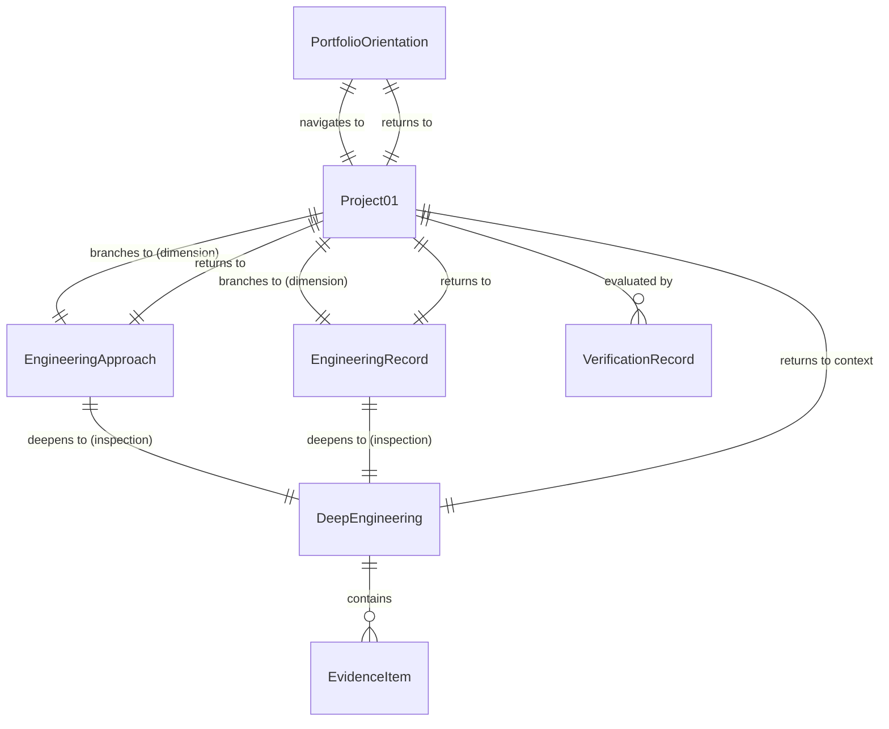

# Data Model: Project 01 — Portfolio Experience

**Feature Branch**: `001-project-01-portfolio-experience`  
**Date**: 2026-09-28  
**Spec**: [spec.md](./spec.md)  
**Status**: Complete (Proposed for Human Review)

---

## 1. Overview

This document specifies the domain data entities, relationships, validation constraints, and state transitions for the software implementation of Project 01 — Portfolio Experience.

These models are purely client-side data structures that enforce:

1. Strict fidelity to the approved content and evidence from Stages 01–07.
2. The Evidence & Evaluation System (`Problem → Requirement → Decision → Technical Work → Evidence → Verification → Outcome → Reflection → Growth`).
3. The progressive inspection navigation model without dead ends or broken returns.
4. Structured recording of verification findings across V1–V10.

---

## 2. Entity Definitions

### 2.1. ExperienceState (Navigation & Traversal Context)

Represents the visitor's current contextual location within the portfolio experience.

```typescript
export type ExperienceLocation =
  | "orientation" // Portfolio Orientation (Entry / Context)
  | "project-01" // Project 01 (Central Project Context)
  | "engineering-approach" // Engineering Approach (Dimension of Project 01)
  | "engineering-record" // Engineering Record (Dimension of Project 01)
  | "deep-engineering"; // Deep Engineering (Deeper Inspection Level)

export type InspectionDepth =
  | "entry" // Depth Level 0: Context
  | "project-context" // Depth Level 1: Central Project
  | "dimension" // Depth Level 2: Approach / Record
  | "deeper-inspection"; // Depth Level 3: Deep Engineering

export interface ExperienceState {
  currentLocation: ExperienceLocation;
  currentDepth: InspectionDepth;
  historyStack: ExperienceLocation[];
  canReturnToProject01: boolean;
  canReturnToOrientation: boolean;
  availableForwardPaths: ExperienceLocation[];
}
```

#### Validation Rules:

- When `currentLocation === 'deep-engineering'`, `currentDepth` MUST be `'deeper-inspection'`.
- When `currentLocation === 'engineering-approach'` or `'engineering-record'`, `currentDepth` MUST be `'dimension'`.
- When `currentLocation === 'deep-engineering'`, `canReturnToProject01` MUST be `true`.
- When `currentLocation === 'project-01'`, `canReturnToOrientation` MUST be `true`.

---

### 2.2. PortfolioOrientation (Entry / Context)

Represents the entry state for the portfolio experience.

```typescript
export interface PortfolioOrientation {
  id: "orientation";
  title: string; // "Portfolio Orientation"
  subtitle: string; // "Desktop / Entry Context"
  description: string; // Approved orientation narrative
  entryDestination: "project-01";
  metadata: {
    role: string;
    stage: string;
  };
}
```

---

### 2.3. Project01 (Central Project Context)

Represents the central professional engineering project experience and hub.

```typescript
export interface Project01 {
  id: "project-01";
  title: string; // "Project 01"
  subtitle: string; // "Portfolio Experience"
  overview: string; // Approved Project 01 summary
  dimensions: {
    approachId: "engineering-approach";
    recordId: "engineering-record";
  };
  returnDestination: "orientation";
}
```

---

### 2.4. EngineeringApproach (Project Dimension)

Represents how the engineering work is understood, advanced, evaluated, and clarified.

```typescript
export interface EngineeringApproach {
  id: "engineering-approach";
  title: string; // "Engineering Approach"
  parentProject: "project-01";
  governingPhilosophy: string; // "Understand → Push Forward Under Uncertainty → Evaluate → Identify Gaps → Iterate → Establish Sufficient Clarity"
  sections: Array<{
    heading: string;
    body: string;
  }>;
  deeperInspectionDestination: "deep-engineering";
  returnDestination: "project-01";
}
```

---

### 2.5. EngineeringRecord (Project Dimension)

Represents what occurred, decisions made, revisions, verifications, and unresolved matters.

```typescript
export interface DecisionRecord {
  id: string;
  timestamp?: string;
  topic: string;
  problem: string;
  decision: string;
  revisionHistory?: string[];
  status: "decided" | "revised" | "unresolved";
}

export interface EngineeringRecord {
  id: "engineering-record";
  title: string; // "Engineering Record"
  parentProject: "project-01";
  chronologicalEntries: DecisionRecord[];
  visibleUncertainties: Array<{
    topic: string;
    description: string;
    status: "unresolved";
  }>;
  deeperInspectionDestination: "deep-engineering";
  returnDestination: "project-01";
}
```

---

### 2.6. DeepEngineering (Deeper Inspection Layer)

Represents the deliberate increase in inspection depth into concrete engineering evidence.

```typescript
export interface DeepEngineering {
  id: "deep-engineering";
  title: string; // "Deep Engineering"
  parentProject: "project-01";
  subtitle: string; // "Design Foundations" (or approved subtitle)
  caseStudy: {
    title: string; // "Design Foundations Verification"
    overview: string;
    evidenceItems: EvidenceItem[];
  };
  returnDestination: "project-01"; // Explicit return to central project
}
```

#### Validation Rules:

- `DeepEngineering` MUST NOT link directly to `orientation` as an exit; its established return path is strictly `project-01`.

---

### 2.7. EvidenceItem (Traceable Evidence Node)

Represents an atomic, traceable unit in the Evidence & Evaluation System.

```typescript
export interface EvidenceItem {
  id: string; // e.g., "EVID-DF-01"
  problem: string; // What problem was encountered
  requirement: string; // Traceable requirement satisfied
  decision: string; // Engineering decision taken
  technicalWork: string; // Concrete work performed
  evidence: string; // Verifiable artifact or record
  verification: string; // How it was verified
  outcome: string; // Observed result (not unsupported claim)
  reflection: string; // Engineering reflection
  growth: string; // Competency or process improvement
  uncertainty?: string; // Visible open questions (if any)
}
```

#### Traceability Relationship Chain:

```
Problem → Requirement → Decision → Technical Work → Evidence → Verification → Outcome → Reflection → Growth
```

---

### 2.8. VerificationRecord (V1–V10 Quality Evaluation)

Represents structured findings across the ten verification categories from Section 6 of `docs/STAGE-08-ENGINEERING-IMPLEMENTATION.md`.

```typescript
export type VerificationCategory =
  | "V1_FUNCTIONAL"
  | "V2_EXPERIENCE_BEHAVIORAL"
  | "V3_VISUAL_DESIGN_FIDELITY"
  | "V4_RESPONSIVE"
  | "V5_ACCESSIBILITY"
  | "V6_PERFORMANCE"
  | "V7_SECURITY"
  | "V8_COMPATIBILITY"
  | "V9_CONTENT_EVIDENCE_INTEGRITY"
  | "V10_BUILD_DEPLOYMENT";

export type VerificationStatus =
  | "verified"
  | "partially_verified"
  | "not_verified"
  | "not_applicable";

export interface VerificationCheck {
  id: string;
  category: VerificationCategory;
  name: string;
  criterion: string;
  status: VerificationStatus;
  evidenceRef: string;
  notes?: string;
}
```

---

## 3. Entity Relationships Diagram



---

## 4. State Transitions & Invariants

| From State             | Allowed Transitions (Action)                                          | Disallowed Transitions (Blocked)                             |
| ---------------------- | --------------------------------------------------------------------- | ------------------------------------------------------------ |
| `orientation`          | → `project-01`                                                        | → `approach`, `record`, `deep-engineering`                   |
| `project-01`           | → `engineering-approach`<br>→ `engineering-record`<br>→ `orientation` | → `deep-engineering` (direct jump without dimension context) |
| `engineering-approach` | → `deep-engineering`<br>→ `project-01`                                | → `orientation` (must return via Project 01)                 |
| `engineering-record`   | → `deep-engineering`<br>→ `project-01`                                | → `orientation` (must return via Project 01)                 |
| `deep-engineering`     | → `project-01` (contextual return)                                    | → `orientation` (bypassing central project)                  |

---

## 5. Summary of Model Guarantees

1. **Information Architecture Integrity**: Direct representation of all 5 states without invented destinations.
2. **Contextual Return Guarantees**: Strict invariants ensure visitors cannot jump to an unrelated destination or bypass the central project context.
3. **Traceability**: `EvidenceItem` models the full 9-step evidence chain verbatim.
4. **Verification Grounding**: `VerificationRecord` models the 10 verification categories with explicit status distinctions (`verified`, `partially_verified`, `not_verified`, `not_applicable`).
