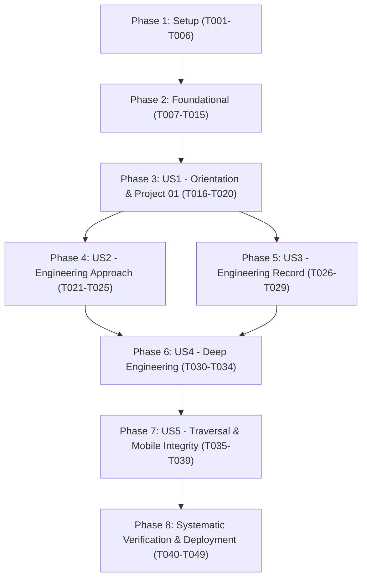

# Tasks: Project 01 — Portfolio Experience

**Input**: Design documents from `/specs/001-project-01-portfolio-experience/`  
**Prerequisites**: `spec.md`, `plan.md`, `research.md`, `data-model.md`, `contracts/ui-contracts.md`, `quickstart.md`  
**Governing Documents**: `.specify/memory/constitution.md`, `docs/STAGE-08-ENGINEERING-IMPLEMENTATION.md`, `docs/PROJECT-01.md`  
**Approved Technical Decisions**:

1. **Routing & Navigation**: Vue Router with hash-mode history (`createWebHashHistory()`), strictly preserving the established five-state navigation topology (`Orientation → Project 01 ↔ Approach / Record → Deep Engineering → Project 01`) and return paths with zero invented destinations.
2. **Styling Architecture**: Global CSS custom properties (`app/src/styles/tokens.css`) encoding approved Stage 04 semantic design tokens combined with Vue `<style scoped>` for component-local styles; preserving approved visual foundations with zero external design systems or utility CSS frameworks.
3. **Mobile Navigation**: Sticky top contextual navigation (`MobileNav.vue`) preserving the established contextual return-path model for viewports `<768px`.
4. **CI/CD & Deployment Strategy**: GitHub Actions on Node.js 24 with mandatory verification gate (lint, test, build) on pushes to `main`. Static deployment to GitHub Pages is strictly triggered by git release tags matching `v*.*.*`; everyday pushes to `main` do not deploy.

---

## Format: `[TaskID] [P?] [Story?] Description with file path`

- **[P]**: Parallelizable task (independent file, no dependencies on uncompleted tasks)
- **[Story]**: User story identifier (`[US1]` through `[US5]`) from `spec.md`
- Every task specifies exact file paths and verifiable completion criteria.

---

## Phase 1: Setup (Application Foundation & Infrastructure)

**Purpose**: Scaffolding the pure client-side Vue 3 + TypeScript + Vite project, test runners, self-hosted assets, and global styling tokens.

- [ ] T001 Initialize client project scaffolding and configuration in `app/package.json`, `app/tsconfig.json`, and `app/vite.config.ts` configuring Vue 3 plugin (`@vitejs/plugin-vue`) and TypeScript strict mode.
- [ ] T002 [P] Establish initial test-runner configurations in `app/vite.config.ts` (Vitest) and `playwright.config.ts` (Playwright) and configure scripts in `app/package.json` for Vite dev, build, preview, Vitest, Playwright, and axe-core accessibility testing per `quickstart.md`, enabling immediate test execution during user story phases.
- [ ] T003 [P] Establish self-hosted font assets in `app/public/assets/fonts/` for IBM Plex Sans (Light, Regular, Medium, SemiBold WOFF2) and configure `@font-face` rules in `app/src/styles/typography.css` ensuring zero external CDN dependencies (FR-018, SC-004).
- [ ] T004 [P] Establish the accepted Stage 04 Direction C semantic design tokens (light canvas `#FFFFFF`, primary text `#18212B`, secondary text `#52606D`, primary blue `#245B8F`, accent surface `#E3EEF7`, border `#D9DEE3`, typography, and spacing) in `app/src/styles/tokens.css` to govern component-local styling without utility frameworks or external CSS libraries (FR-018).
- [ ] T005 [P] Create modular SVG icon and vector connector assets in `app/public/assets/icons/` for depth badges, connector lines, and return arrows (FR-018).
- [ ] T006 [P] Establish responsive CSS Grid and Flexbox layout primitives and reset styles in `app/src/styles/layout.css` defining breakpoints for Mobile (`<768px`), Tablet (`768px–1024px`), and Desktop (`>1024px`, baseline `1440px`).

---

## Phase 2: Foundational (Core Models, Routing, & Application Shell)

**Purpose**: Shared infrastructure and domain contracts that MUST be complete before user story views can be rendered.

- [ ] T007 [P] Implement core domain TypeScript interfaces in `app/src/models/experience.ts` defining `ExperienceLocation` (`'orientation' | 'project-01' | 'engineering-approach' | 'engineering-record' | 'deep-engineering'`), `InspectionDepth` (`'entry' | 'project-context' | 'dimension' | 'deeper-inspection'`), and `ExperienceState` per `data-model.md`.
- [ ] T008 [P] Implement evidence and verification TypeScript interfaces in `app/src/models/evidence.ts` and `app/src/models/verification.ts` encoding the 9-part relationship chain (`Problem → Requirement → Decision → Technical Work → Evidence → Verification → Outcome → Reflection → Growth`) and the 10 verification categories (`V1` to `V10`) per `data-model.md`.
- [ ] T009 Implement client hash-mode router using `vue-router` with `createWebHashHistory()` in `app/src/router/index.ts`, strictly preserving the established five-state navigation topology (`Orientation → Project 01 ↔ Approach / Record → Deep Engineering` with return paths `Deep Engineering → Project 01` and `Approach / Record → Project 01 → Orientation`) without inventing additional destinations, mapping canonical routes (`#/orientation`, `#/project-01`, `#/approach`, `#/record`, `#/deep-engineering`), default redirect to `#/orientation`, and title/depth metadata synchronization (FR-002, contracts/ui-contracts.md).
- [ ] T010 Implement route navigation guard and programmatic focus management in `app/src/router/index.ts` shifting focus to `#main-content` heading and updating `aria-live="polite"` depth announcements on every state transition per `contracts/ui-contracts.md`.
- [ ] T011 Create main application shell in `app/src/App.vue` providing semantic layout landmarks (`<header role="banner">`, `<main id="main-content" tabindex="-1">`, `<nav>`), depth indicator container, view transition outlet, and layout styling via Vue `<style scoped>` consuming global tokens.
- [ ] T012 Implement the Penpot-aligned desktop professional identity header centered on `Adnan Abdullahi`, adapted to the accepted five-state information architecture and without restoring generic portfolio tabs (FR-002, FR-013).
- [ ] T013 Implement responsive mobile navigation consistent with the accepted identity/header direction and the established navigation topology, preserving keyboard accessibility and return paths (FR-002, FR-013).
- [ ] T014 Implement inspection depth badge component in `app/src/components/DepthIndicator.vue` rendering active depth labels (`Entry Context`, `Project Context`, `Dimension`, `Deeper Inspection`) with semantic color styling via Vue `<style scoped>`.
- [ ] T015 Implement deterministic lateral return rail component in `app/src/components/ReturnRail.vue` rendering contextual return controls ("Return to Project 01" / "Return to Portfolio Orientation") with high-contrast keyboard focus indicators via Vue `<style scoped>` (FR-004, FR-010, contracts/ui-contracts.md).

---

## Phase 3: User Story 1 - Portfolio Orientation to Project 01 Entry & Central Context (Priority: P1) 🎯 MVP

**Goal**: Deliver the primary entry context (Portfolio Orientation) and the central project hub (Project 01), verifying bidirectional traversal and contextual orientation.

**Independent Test**: Visitor begins at `#/orientation`, inspects entry narrative, activates "Explore Project 01", arrives at `#/project-01` with Project Context depth indicator, and uses the return control to navigate back to `#/orientation` (US1, SC-001, SC-002).

### Tests for User Story 1

- [ ] T016 [P] [US1] Create unit tests for Orientation and Project 01 state models and route navigation in `tests/unit/orientation-project01.test.ts`.
- [ ] T017 [P] [US1] Create Playwright E2E navigation test in `tests/e2e/us1-orientation-project01.spec.ts` verifying forward navigation (`#/orientation` → `#/project-01`) and return navigation (`#/project-01` → `#/orientation`).

### Implementation for User Story 1

- [ ] T018 [P] [US1] Create approved text content modules for Orientation in `app/src/content/orientation.ts` and Project 01 overview in `app/src/content/project01.ts` faithfully preserving Stage 05/06 text verbatim (FR-017, FR-019).
- [ ] T019 [US1] Implement `app/src/views/OrientationView.vue` rendering approved portfolio entry context, role/stage metadata, and primary call-to-action button linking to `#/project-01`, styled with Vue `<style scoped>` consuming global tokens (FR-003, US1).
- [ ] T020 [US1] Implement `app/src/views/Project01View.vue` rendering central project title, overview, dimensional branching hubs for Approach and Record, and return navigation back to Portfolio Orientation, styled with Vue `<style scoped>` consuming global tokens (FR-004, US1).

**Checkpoint**: User Story 1 is functional and testable independently as an initial MVP slice.

---

## Phase 4: User Story 2 - Branching to Engineering Approach (Priority: P1)

**Goal**: Provide the Engineering Approach dimension view communicating how engineering work is understood, advanced, evaluated, and clarified, with return path to Project 01 and forward path to Deep Engineering.

**Independent Test**: From `#/project-01`, visitor selects Engineering Approach, arrives at `#/approach` with Dimension depth indicator, inspects the governing philosophy, and can return to `#/project-01` or advance to `#/deep-engineering` (US2, SC-001, SC-002).

### Tests for User Story 2

- [ ] T021 [P] [US2] Create unit tests for Engineering Approach content structure and navigation events in `tests/unit/approach.test.ts`.
- [ ] T022 [P] [US2] Create Playwright E2E test in `tests/e2e/us2-approach.spec.ts` verifying traversal from `#/project-01` to `#/approach` and return to `#/project-01`.

### Implementation for User Story 2

- [ ] T023 [P] [US2] Create approved text content module for Engineering Approach in `app/src/content/approach.ts` containing the governing philosophy (`Understand → Push Forward Under Uncertainty → Evaluate → Identify Gaps → Iterate → Establish Sufficient Clarity`) and methodology sections (FR-012, FR-017).
- [ ] T024 [P] [US2] Implement reusable dimensional navigation card component in `app/src/components/DimensionCard.vue` rendering title, summary, and action link for project dimensions, styled with Vue `<style scoped>`.
- [ ] T025 [US2] Implement `app/src/views/ApproachView.vue` displaying Engineering Approach narrative, governing philosophy, dimension badge, action link to Deep Engineering (`#/deep-engineering`), and return control to `#/project-01`, styled with Vue `<style scoped>` consuming global tokens (FR-005, US2).

**Checkpoint**: User Story 2 is functional and testable independently alongside User Story 1.

---

## Phase 5: User Story 3 - Branching to Engineering Record (Priority: P1)

**Goal**: Provide the Engineering Record dimension view capturing historical decisions, revisions, verifications, and visible uncertainty, maintaining clear conceptual and visual distinction from Engineering Approach.

**Independent Test**: From `#/project-01`, visitor selects Engineering Record, arrives at `#/record` with Dimension depth indicator, inspects decisions and visible uncertainties, and can return to `#/project-01` or advance to `#/deep-engineering` (US3, SC-001, SC-002).

### Tests for User Story 3

- [ ] T026 [P] [US3] Create unit tests for Engineering Record decision entries and visible uncertainty models in `tests/unit/record.test.ts`.
- [ ] T027 [P] [US3] Create Playwright E2E test in `tests/e2e/us3-record.spec.ts` verifying traversal from `#/project-01` to `#/record`, return to `#/project-01`, and distinct visual styling from Approach.

### Implementation for User Story 3

- [ ] T028 [P] [US3] Create approved text content module for Engineering Record in `app/src/content/record.ts` containing chronological decision records, revisions, and explicit visible uncertainties (FR-006, FR-015, FR-017).
- [ ] T029 [US3] Implement `app/src/views/RecordView.vue` displaying chronological decision cards, visible uncertainty callouts, dimension badge, action link to Deep Engineering (`#/deep-engineering`), and return control to `#/project-01`, styled with Vue `<style scoped>` consuming global tokens (FR-006, FR-007, US3).

**Checkpoint**: User Stories 1, 2, and 3 are functional and demonstrate clear distinction between Approach and Record.

---

## Phase 6: User Story 4 - Progressive Inspection into Deep Engineering & Contextual Return (Priority: P1)

**Goal**: Deliver the Deep Engineering view exposing concrete engineering evidence (Design Foundations case study) with full 9-part traceability, preserving the invariant that Deep Engineering is a deeper inspection level within Project 01 that returns strictly to Project 01.

**Independent Test**: From either `#/approach` or `#/record`, visitor advances to `#/deep-engineering`, inspects Design Foundations case study evidence, and activates the return control to return directly to `#/project-01` (US4, SC-001, SC-002).

### Tests for User Story 4

- [ ] T030 [P] [US4] Create unit tests for EvidenceItem model validation and 9-part relationship chain in `tests/unit/deep-engineering.test.ts`.
- [ ] T031 [P] [US4] Create Playwright E2E test in `tests/e2e/us4-deep-engineering.spec.ts` verifying entry from Approach/Record to Deep Engineering and strict return traversal back to `#/project-01`.

### Implementation for User Story 4

- [ ] T032 [P] [US4] Create approved content module for Deep Engineering in `app/src/content/deep-engineering.ts` containing the Design Foundations verification case study and atomic evidence nodes (FR-016, FR-017).
- [ ] T033 [P] [US4] Implement evidence card component in `app/src/components/EvidenceCard.vue` rendering the complete 9-part evidence chain (`Problem`, `Requirement`, `Decision`, `Technical Work`, `Evidence`, `Verification`, `Outcome`, `Reflection`, `Growth`) with visible uncertainty badges for open questions per `contracts/ui-contracts.md`, styled with Vue `<style scoped>` (FR-011, FR-015).
- [ ] T034 [US4] Implement `app/src/views/DeepEngineeringView.vue` displaying the Design Foundations verification case study, Deeper Inspection depth indicator, atomic evidence cards, and explicit lateral return rail to `#/project-01`, styled with Vue `<style scoped>` consuming global tokens (FR-008, FR-009, FR-010, US4).

**Checkpoint**: User Story 4 is functional, verifying the progressive inspection model and evidence traceability.

---

## Phase 7: User Story 5 - Experience Traversal & Return Path Integrity (Priority: P2)

**Goal**: Ensure end-to-end traversal integrity across all forward and return paths, active contextual orientation, mobile sticky top navigation, and accessibility standards without dead ends.

**Independent Test**: Automated test traverses all branches of the Experience Map (`Orientation → Project 01 ↔ Approach / Record → Deep Engineering → Project 01 → Orientation`), verifying zero broken links, consistent depth indicators, and keyboard focus shifts (US5, SC-002).

### Tests for User Story 5

- [ ] T035 [P] [US5] Create full Experience Map traversal E2E test in `tests/e2e/us5-traversal-integrity.spec.ts` exercising every forward and return path.
- [ ] T036 [P] [US5] Create multi-viewport responsive test in `tests/e2e/responsive.spec.ts` verifying Mobile (`375px`), Tablet (`768px`), and Desktop (`1440px`) layouts with sticky top mobile navigation (FR-020 V4).
- [ ] T037 [P] [US5] Create automated axe-core accessibility audit in `tests/a11y/accessibility.spec.ts` scanning all five views for WCAG 2.1 AA compliance and visible keyboard focus rings (FR-020 V5).

### Implementation for User Story 5

- [ ] T038 [US5] Integrate sticky top mobile navigation bar (`MobileNav.vue`) into all view templates, verifying it stays pinned on scroll for screens `<768px` and provides immediate return navigation to Project 01 with `<style scoped>` responsive styling (FR-004, FR-010, US5).
- [ ] T039 [US5] Implement view transition animations adhering to `prefers-reduced-motion` media query in `app/src/styles/layout.css` ensuring immediate transitions when reduced motion is preferred (FR-013, FR-020 V5).

**Checkpoint**: Complete five-state experience is fully traversed, responsive, and accessible.

---

## Phase 8: Systematic Verification, Build Process, & Tagged-Release Deployment

**Purpose**: Cross-cutting verification against V1–V10 categories, static production build optimization, and release-tag deployment workflow.

- [ ] T040 Implement verification matrix component in `app/src/components/VerificationMatrix.vue` displaying structured evaluation status across categories V1 through V10 per `data-model.md` and `quickstart.md`, styled with Vue `<style scoped>` (FR-020, SC-005).
- [ ] T041 [P] Execute final comprehensive Vitest unit and integration test suite via `npm.cmd run test:unit`, verifying all domain model invariants, navigation logic, and component behaviors pass cleanly against Category V1 verification criteria (FR-020 V1).
- [ ] T042 [P] Execute final comprehensive Playwright end-to-end traversal test suite via `npm.cmd run test:e2e`, verifying full user journey traversal, lateral return path integrity, and visual/functional assertions across all five states against Category V2 verification criteria (FR-020 V2).
- [ ] T043 [P] Verify visual design fidelity and token adherence by auditing typography, colors, and 1440px desktop multi-column alignment against Stage 04 design foundations (FR-018, FR-020 V3).
- [ ] T044 [P] Verify production build and bundle size budget via `npm.cmd run build` ensuring pure static output in `dist/` with total gzipped JS/CSS `< 150KB` and zero external runtime network requests (FR-020 V6, V10).
- [ ] T045 [P] Run security dependency audit via `npm.cmd audit` verifying zero high/critical vulnerabilities and confirming zero credentials or secret tokens exist in the static bundle (FR-020 V7).
- [ ] T046 [P] Verify cross-browser compatibility across modern rendering engines (Chromium, Firefox, WebKit) via Playwright (FR-020 V8).
- [ ] T047 [P] Perform content and evidence integrity review verifying approved copy from Stages 06 and 07 is rendered verbatim with zero manufactured claims or omitted uncertainties (FR-014, FR-017, FR-020 V9).
- [ ] T048 Create GitHub Actions CI/CD workflow in `.github/workflows/deploy.yml` on Node.js 24 establishing a mandatory verification gate (lint, test, build) on pushes to `main`, and gating static production deployment to GitHub Pages exclusively to pushes of git release tags matching `v*.*.*`, ensuring everyday pushes to `main` verify build integrity without deploying (FR-001, FR-020 V10, Constitution P1).
- [ ] T049 Perform end-to-end dry-run verification of the production static bundle using `npm.cmd run preview` confirming full offline operation without runtime errors (FR-020 V10).

---

## Dependencies & Execution Order

### Phase Dependencies

### User Story Dependencies

- **User Story 1 (P1)**: Depends on Phase 2 (Foundational). Delivers the MVP core (Orientation + Project 01).
- **User Story 2 (P2)**: Depends on User Story 1. Delivers the Approach dimension.
- **User Story 3 (P3)**: Depends on User Story 1. Delivers the Record dimension (can run in parallel with US2).
- **User Story 4 (P4)**: Depends on User Story 2 and User Story 3. Delivers Deep Engineering and Design Foundations evidence.
- **User Story 5 (P5)**: Depends on User Stories 1–4. Validates full Experience Map traversal, mobile sticky navigation, and accessibility.

---

## Implementation Strategy

### MVP First (User Story 1)

1. Complete Phase 1 (Setup) and Phase 2 (Foundational).
2. Complete Phase 3 (User Story 1: Orientation + Project 01).
3. **STOP & VALIDATE**: Run `npm.cmd run test:unit` and `npm.cmd run test:e2e` to confirm the central project hub operates cleanly before expanding into dimensions.

### Incremental Delivery

1. Add User Story 2 (Approach) → Validate dimension branching and return path.
2. Add User Story 3 (Record) → Validate decision log, revisions, and Approach/Record distinction.
3. Add User Story 4 (Deep Engineering) → Validate 9-part evidence chain and return to Project 01.
4. Add User Story 5 (Traversal & Mobile) → Validate sticky top mobile nav and accessibility across all viewports.
5. Execute Phase 8 (Verification & CI/CD) → Record V1–V10 findings and establish tagged-release deployment.
